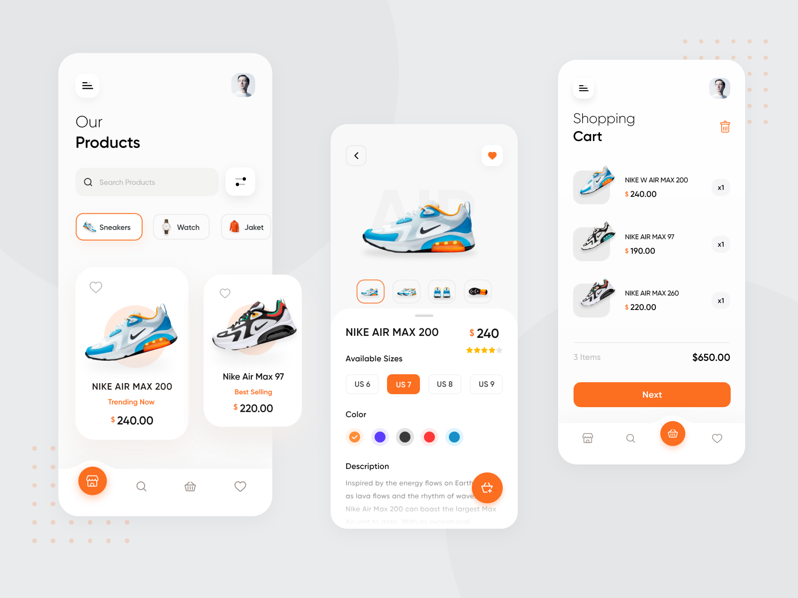

- [ ] Create atoms
- [ ] Create Molecules
- [ ] Create Organisms
- [ ] Create Templates
- [ ] Create Pages

# Arch folder

# Ref design

https://dribbble.com/shots/10446127-E-commerce-App-Exploration/attachments/2283107?mode=media


```shell
lib/
  atoms/
    button_atom.dart
    text_field_atom.dart
  molecules/
    login_form.dart
    search_bar.dart
  organisms/
    header.dart
    sidebar.dart
  templates/
    home_page_template.dart
  pages/
    home_page.dart
```


# Folders

folder ``app`` has a main application

## Visitors Count

